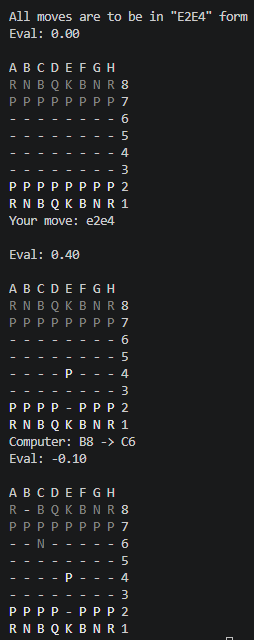
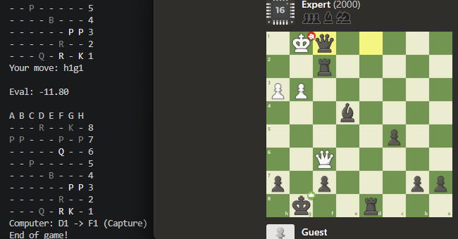
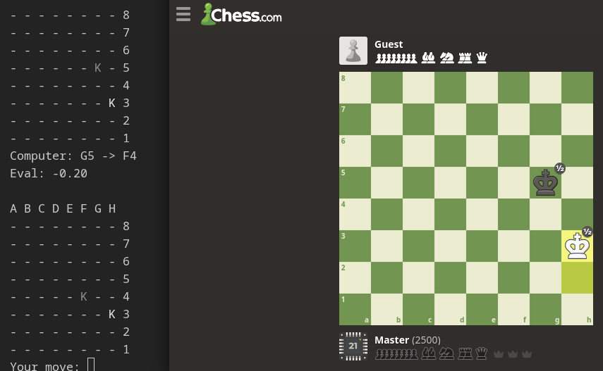

# Simple Chess Engine
Here is my attempt at a chess engine.

So far it uses simplified evaluation function (SEF) with alpha-beta negamax search + quiescence negamax search
as its engine.



## Building
To build the playable binary,
```bash
make bin    # Run the binary at bin/sce_play
```
Note that you can only play as white at the moment, as this is a test binary,
though I might make you be able to choose.

To build the unit test,
```bash
make test   # Run the test at bin/test
```
To build the documentation (although at the moment it is not maintained, it may be later)
```bash
make doc    # Requires Doxygen
```

## Note
There are clearly a lot of work to do, but so far I think it is of good quality for a PoC engine
(for something that was built hastily in 3 weeks)!

## Benchmark
I am testing against bots from [Chess.com](https://www.chess.com/).

### ELO 2000


This suggests that the current bot may be better than ELO 2000.


This suggests that the current bot (Depth 9 -> 10 (after phase < 15)) is roughly ELO 2500.