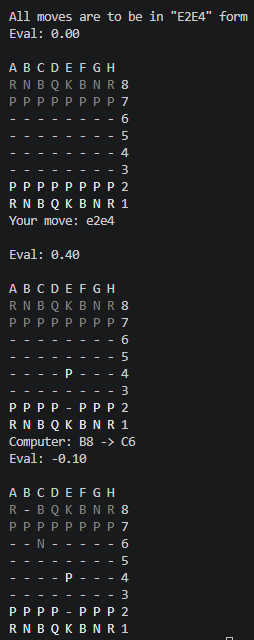

# Simple Chess Engine
Here is my attempt at a chess engine.

So far it uses simplified evaluation function (SEF) with alpha-beta negamax search + quiescence negamax search
as its engine.



## Building
To build the playable binary / UCI engine (with debug info),
```bash
# Playable binary at bin/sce_play ("less maintained" but still playable)
# UCI engine at bin/sce_uci_engine
make bin
```

To build release binaries,
```bash
make release
```

To build the unit test,
```bash
make test   # Run the test at bin/test
```
To build the documentation (although at the moment it is not maintained, it may be later)
```bash
make doc    # Requires Doxygen
```

## Note
There are clearly a lot of work to do, but so far I think it is of good quality for a PoC engine.

### List of Things in Mind
Here is a list of optimizations that are used/attempted (and they seem to be standard in the world of chess programming)

* **Bitboard**: Since there are 64 squares on the chessboard, uint64_t is used for each piece to track where they are.
* **Lockless Transposition Table**: A cache table holding information about the best move / alpha-beta values at a specific hash of board.
* **Iterative Deepening**: Instead of searching from depth n, I search best move from depth 1 to n, filling transposition table for speeding up later moves.
* **Incremental Evaluation**: SEF and HCEF are provided in "full evaluation function" form and "delta (incremental) evaluation function" form.
* **Make/Unmake** vs Copy: I chose Make/Unmake moves instead of copying the board. This saves on memory as larger depths are searched.
* **CPU Cache**: Noting that the cache line size of modern x86 architecture is 64 bytes, I keep commonly accessed structs under 64 bytes and align the memory.
* **Compiler Intrinsics**: Some compiler intrinsic functions from GCC are used for attempting to use CPU instructions.
* **Lazy SMP**: Multi-threading with lockless transposition table causes transposition table entries to be filled by different threads, causing each thread to search different branches by intentionally invoking race conditions.
* **Killer Moves and Move Ordering**: Since alpha-beta negamax search is used, it is better to search moves that are "probably good" first in order to cause pruning fast. Killer moves are moves that caused beta-cutoff, which are probably some of the "potentially best moves"

Here is a list of other miscellaneous things that I kept in mind.

* **NULL check avoidance**: In the beginning of development in [chess.c](./src/chess.c), I programmed "defensively" by adding NULL checks, as it is often a good practice. In chess programming, however, these add overhead; when developing [engine.c](./src/engine.c), I started adding "assert" statements which can be removed with a debug flag. Hopefully, the compiler is smart enough to strip all the defensively added NULL checks during release build.
* **Separation of Chess Logic and Engine Logic**: While high performance chess engines have chess logic and engine logic intertwined for maximal efficiency, I still wanted to keep them separate (AKA modular), so that I could migrate my chess logic elsewhere if I were to create another project involving chess.
    * Portability is also kept in mind. I think migrating to CUDA, for example, might be very easy.
* **Evaluation Function by Function Pointer**: I provide `SCE_Engine` struct with function pointers for EvalFunc and DeltaEvalFunc so that it is easy for me to swap different evaluation functions for testing.

## Benchmark
### Methodology
Here are the steps taken for the measurements.
I acknowledge that the measurement could be more formal,
but I do not want to pull my hair out for this hobby project.

Note that most of the internal calculation is done by Cutechess anyways.

#### Prerequisites
* Stockfish
* Cutechess

0. Take an estimate ($R$) of the ELO for SCE.
1. Download and install Stockfish and Cutechess.
2. Open Cutechess GUI
    * I wanted to use Cutechess CLI, but it seems to be buggy on my machine...
3. Add `bin/sce_uci_engine` as a new engine in Cutechess GUI.
    * Go to Advanced, and toggle on the DynamicDeepening option.
4. Add Stockfish as a new engine in Cutechess GUI.
    * Go to Advanced, and toggle UCI_LimitStrength on.
    * Also set UCI_Elo value to the ELO estimate from Step 0.
5. Play 100 games of tournament between SCE and Stockfish.
6. Using the number of wins ($W$) and draws ($D$), calculate the expected score ($E$).
```math
E = \frac{W + 0.5 D}{N}
```
where
* $W$ is the number of wins.
* $D$ is the number of draws.
* $N$ is the total number of games played.

7. Calculate the ELO difference by the following formula.
```math
\Delta R = -400 \log_{10} \left( \frac{1}{E} - 1 \right)
```

8. Add this $\Delta R$ to the estimated ELO.
9. Update the estimated ELO and repeat the process again if wanted.

### Benchmark Results (SEF)

Preliminary Results (After LMR Refinement)

| depth | R    | W   | D   | N   | dR     | Approx ELO    |
|-------|------|-----|-----|-----|--------|---------------|
| 5     | 2200 | 138 |  82 | 500 | -101.5 | 2098.5+/-28.8 |

### Benchmark Results (HCEF)

| depth | R    | W   | D   | N   | dR     | Approx ELO    |
|-------|------|-----|-----|-----|--------|---------------|
| 5     | 2200 | 141 |  68 | 500 | -107.5 | 2092.5+/-29.5 |
| 6     | 2200 | 212 |  88 | 500 |  -11.1 | 2188.9+/-27.7 |
| 7     | 2200 | 235 |  89 | 500 |   41.2 | 2241.2+/-27.8 |
| 8     | 2200 | 271 |  91 | 500 |   94.7 | 2294.7+/-28.4 |
| 9     | 2200 | 306 |  81 | 500 |  141.4 | 2341.4+/-29.8 |


### Methodology in the Future
It turns out I could use CLI for this, which is probably better for testing (as I am away from my compute server machine often).

Here is a reference command I could use
```bash
# 4 Concurrent games where SCE uses depth 5 and Stockfish is at ELO 2100 with move time limit set to 2100.
# Playing ten games. Since 10 is even, the color switches back and forth.
cutechess-cli -engine name="SCE" cmd=./bin/sce_uci_engine option.DynamicDeepening=true depth=5 tc=inf -engine name="Stockfish" cmd=stockfish option.UCI_LimitStrength=true option.UCI_Elo=2200 depth=18 tc=60+0.6 -each proto=uci -games 10 -repeat -concurrency 1
```

### Using Makefile for Benchmark
You can run the benchmark using the provided Makefile target:
```bash
make benchmark
```
This will build the engine with optimizations enabled (release build with `-DNDEBUG`) and run it against Stockfish using the following default parameters:
- Depth: 5
- Number of games: 10
- Stockfish ELO: 2200
- Concurrency: 1 concurrent game

You can override these parameters by setting the corresponding make variables:
```bash
make benchmark BENCH_DEPTH=7 BENCH_GAMES=20 BENCH_ELO=2200 BENCH_CONCURRENCY=8
```
Note that `BENCH_GAMES` must be an even number for a "meaningful" benchmark.
